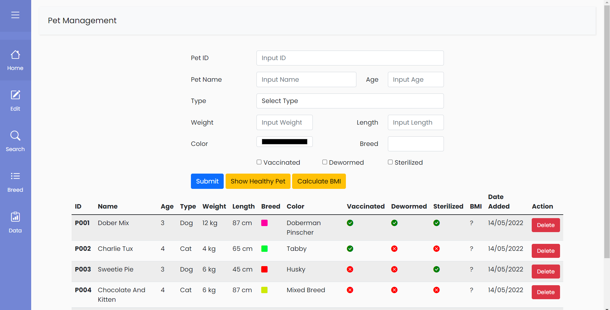
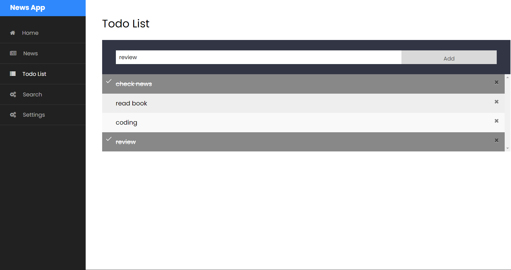
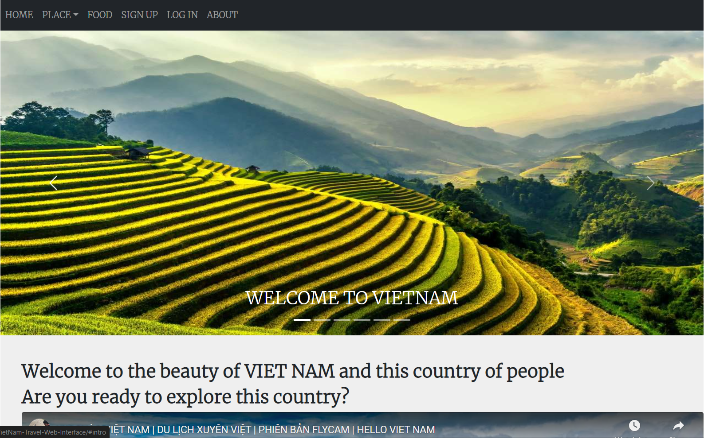
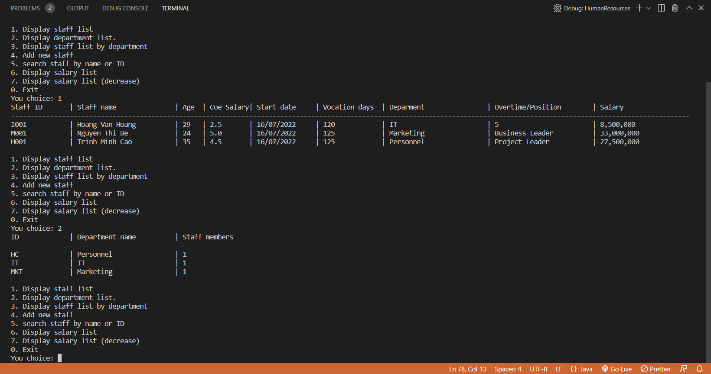

# HOANG THE LONG's Porfolio

## Objective
Hi, my name is Long. born in 1992. I have been interested in programming languages since I was in high school. After studying abroad in Japan, I went on to university to major in information systems, and continued to pursue programming. Currently, I have completed 4 years of university at UMDS university, and want to work as a Developer.Using knowledge about programming

My goal is to become a Junior Developer in first year, after 3 year, I want to become a System Engineer, and after 5 years to aim for the position of Project Manager.

## Skill
### HTML ★★★★★
### CSS ★★★★★
### JavaScript ★★★★☆
### SQL Server ★★★★☆
### Java ★★★☆☆
### Github link: [https://github.com/HTL0](https://github.com/HTL0)

## Personal Project

### 1. Project manager pets ver 2 website

- Link github: [https://github.com/HTL0/Pet-magerment-project](https://github.com/HTL0/Pet-magerment-project)
- Description: pet management website, has the following features: add pet, calculate pet's BMI, display pet information, add pet breed, edit information and search pet.
- Project uses HTML and CSS to make interface.
- Use JavaScript to solve BackEnd.
- Database uses localStore.

### 2. Project Website about NEWS and to-do-list management.

- Link github: [https://github.com/HTL0/News-Website](https://github.com/HTL0/News-Website)
- Description : The website has the following features: Register and login, display news, search by keyword, integrate to-do list management.
- Project uses HTML and CSS display design
- Use JavaScript to solve BackEnd
- Database uses localStore
- Use JavaScript work with API [https://newsapi.org/pricing](https://newsapi.org/pricing) to get information. (Because I use API's free account, the website only works on local host).

### 3. Project website's interface to introduce Vietnam travel

- Link github: [https://github.com/HTL0/VietNam-Travel-Web-Interface](https://github.com/HTL0/VietNam-Travel-Web-Interface)
- Description: The web that shares about Vietnam's information and famous Vietnamese foods.
- Project uses HTML and Bootstrap of CSS.
- Use SEO to submit to google to check section.
- Integrate Google Analytics

### 4. Project Human-Resources

- Link github: [https://github.com/HTL0/Human-Resources](https://github.com/HTL0/Human-Resources)
- Description: Human resource management application
- Display: simple console interface
- Use OOP knowledge and java language

# Contact
### Email: lkaikoko[$]gmail.com
(Please replace [$] in the email address with @ symbol.)
